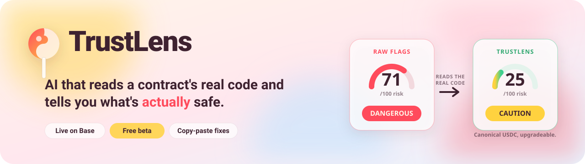

  

  
  
  
  

  <a href="https://trustlens-web.niftyai.workers.dev"><strong>Try it live →</strong></a>

---

> **Know before you ape.** TrustLens reads a contract's real code and tells you what's safe, what's not, and how to fix it.

## What it does

Paste any contract address on Base. TrustLens pulls the verified source, runs a full static analysis, then puts an AI security reviewer on top of the raw output to tell you which flags are real and which are noise.

Here is the part that matters.

Point a raw scanner at Circle's USDC and it lights up like a fire alarm: **DANGEROUS, 100 out of 100.** Blocklists, upgradeable proxies, privileged roles, the works. Technically present. Completely misread.

TrustLens reads the same code and tells you the truth: **SAFE-ISH, 10 out of 100. This is canonical USDC.** The privileged functions are Circle's, they are expected, and they are not going to drain your wallet.

That gap between "flag exists" and "flag matters" is where people get scared out of good contracts and lured into bad ones. TrustLens lives in that gap.

## Why it's different

Raw scanners pattern-match. They see `delegatecall`, they see an owner role, they see a mint function, and they scream. Every flag looks like a five-alarm fire, so every flag gets ignored. Alert fatigue is a security hole.

TrustLens reads the code the way a security researcher would:

- **Triage, not noise.** Every flag gets labeled REAL or false positive, with the reasoning.
- **Context beats keywords.** A mint function on a rug is a threat. A mint function on USDC is Tuesday. TrustLens knows the difference.
- **Proof for the real ones.** When a flag is genuine, you get a concrete example of how it gets exploited, plus a fix you can paste in.

You stop drowning in red. You start seeing what is actually dangerous.

## How it works

1. **Paste an address.** Any verified contract on Base mainnet.
2. **Get the raw scan, free and instant.** Every flag a static analyzer would raise, no signup.
3. **Open the AI deep report, free in beta.** Plain-English triage: what's real, what's noise, and for the real issues, how it gets attacked and how to fix it.

## Try it live

**[trustlens-web.niftyai.workers.dev](https://trustlens-web.niftyai.workers.dev)**

No wallet connection required to scan. No signup to read the report. Free while we are in beta.

Start with USDC if you want to watch a raw "100/100 DANGEROUS" verdict get taken apart line by line.

## For developers

Shipping a contract? TrustLens is a second set of eyes that never gets tired.

For every real issue it finds, you get two things a plain scanner will not give you:

- **A concrete attack example.** Not "reentrancy risk detected." An actual walkthrough of how the funds leave, in the specific shape of your code.
- **A copy-paste fix.** The corrected pattern, ready to drop into your contract.

Triage plus a fix, in the time it takes to read one Slither report by hand.

## Tech stack

| Layer | Built with |
|-------|-----------|
| Frontend | React, Vite, wagmi, viem |
| Backend | FastAPI, Slither, web3.py |
| AI triage | Claude |
| On-chain | Solidity `PaymentGate` on Base |

Static analysis does the detection. The AI layer does the judgment. The frontend keeps it fast and readable.

## Roadmap

Free beta today. Everything below is built and dark until beta ends.

- **Pay-per-scan.** $1.50 a scan, no subscription.
- **Unlimited.** $9 a month for traders and devs who scan all day.
- **Founders NFT.** For the people who showed up early.

## License

MIT.

---

TrustLens reads contracts, not tea leaves. Built by <a href="https://x.com/SafuLens">@SafuLens</a>. Free beta. Not financial advice.
